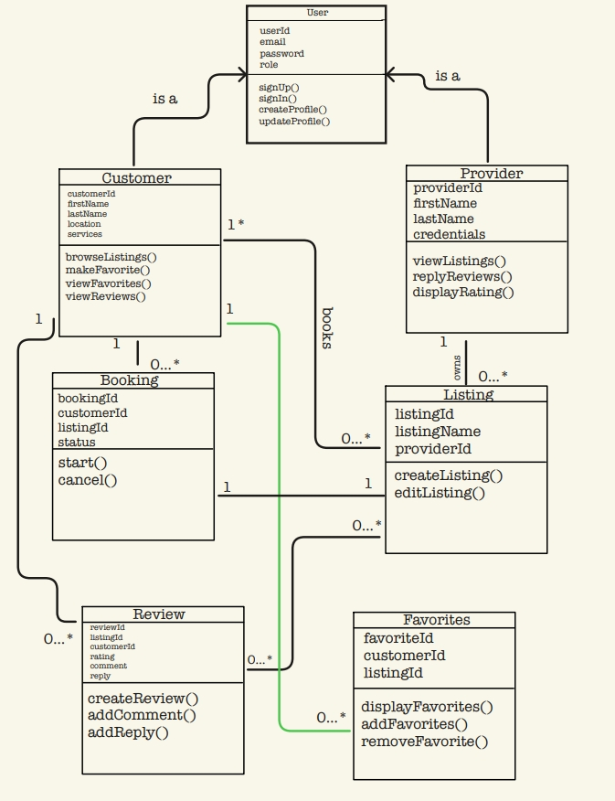

# API Documentation
**Version:** 1.0
**Last Updated:** March 24, 2026
**Base URL:** `http://localhost:8080/api`

---

## Project UML


## Provider Management

### Create Provider
**Endpoint:** `POST /providers`  
**Use Case:** Create Provider Account
**Description:** Create a new provider account.

```http
POST /providers
Content-Type: application/json

{
  "email": "alice@example.com",
  "password": "secret",
  "firstName": "Alice",
  "lastName": "Smith",
  "credentials": "Bachelors in ASL"
}
```

**Response:**
```json
{
"email": "alice@example.com",
	"password": "secret",
	"firstName": "Alice",
	"lastName": "Smith",
	"credentials": "Bachelors in ASL",
	"id": 1,
	"role": "PROVIDER"
}
```

**Status Code:** `201 Created`

### Get All Providers
**Endpoint:** `Get /providers`  
**Use Case:** Get all providers 
**Description:** Retrieve list of all provider accounts.

```http
GET /providers
```

**Status Code:** `200 OK`

---

### Get Provider by ID
**Endpoint:** `GET /providers/{id}`
**Use Case:** Provider profile view
**Description:** Retrieve specific provider by ID.

```http
GET /providers/1
```

**Status Code:** `200 OK` or `404 Not Found`

---

### Get Provider's Customer List
**Endpoint:** `GET /providers/{id}/customers`
**Use Case:** US-PROV-004 (View Current Customers)
**Description:** Retrieve list of customers for specific provider.

```http
GET /providers/{id}/customers
```

**Status Code:** `200 OK`

---

### Update Provider
**Endpoint:** `PUT /providers/{id}`
**Use Case:** US-PROV-001 (Update Profile)
**Description:** Update provider profile information.

```http
PUT /providers/1
Content-Type: application/json

{
  "firstName": "Alice",
  "credentials": "Bachelors in Japanese"
}
```

**Response:** Updated customer object

**Status Code:** `200 OK` or `404 Not Found`

---

### Delete Provider
**Endpoint:** `DELETE /providers/{id}`
**Use Case:** Delete account
**Description:** Delete provider account.

```http
DELETE /providers/1
```

**Status Code:** `204 No Content` or `404 Not Found`

---

## Listing Management

### Create Listing
**Endpoint:** `POST /api/listings`  
**Use Case:** US-PROV-002 (Service Listing)
**Description:** Create a new service listing.

```http
POST /listings
Content-Type: application/json

{
"listingName" = "ASL Tutoring"
}
```

**Response:**
```json
{
"listingName": "ASL Interpreting Tutor",
	"provider": {
		"email": "alice@example.com",
		"password": "secret",
		"firstName": "Alice",
		"lastName": "Smith",
		"credentials": "Bachelors in ASL",
		"id": 1,
		"role": "PROVIDER"
		},
	"listingId": 1
}
```

**Status Code:** `201 Created`

### Get All Listings
**Endpoint:** `Get /listings`  
**Use Case:** Get All Listings 
**Description:** Retrieve list of all service listings.

```http
GET /listings
```

**Status Code:** `200 OK`

---

### Get Listing By ID
**Endpoint:** `GET /listings/{id}`
**Use Case:** Retrieve Listing by ID
**Description:** Retrieve specific listing by its ID.

```http
GET /listings/{id}
```

**Status Code:** `200 OK` or `404 Not Found`

---

### Get Listing by Provider 
**Endpoint:** `GET /listings/provider/{id}`
**Use Case:** Retrieve Listings for Provider
**Description:** Retrieve list of all service listings for specific provider.

```http
GET /listings/provider/{id}
```

**Status Code:** `200 OK`

---

### Update Listing
**Endpoint:** `PUT /listings/{id}`
**Use Case:** US-PROV-003 (Modify Service Listing)
**Description:** Update listing information.

```http
PUT /listings/1
Content-Type: application/json

{
  "listingName" = "ASL Interpreting"
}
```

**Response:** Updated Listing Object

**Status Code:** `200 OK` or `404 Not Found`

---

### Delete Listing
**Endpoint:** `DELETE /listings/{id}`
**Use Case:** US-PROV-003 (Delete Service Listing)
**Description:** Delete provider service listing.

```http
DELETE /providers/1
```

**Status Code:** `204 No Content` or `404 Not Found`

---

### Review Management

#### Create Review
**Endpoint:** `POST /reviews`
**Use Case:** Create Review
**Description:** review creation for provider to view and reply.

```http
POST /reviews
Content-Type: application/json

{
 "comment" = "Great communication"
 "rating" = 5.0;
}
```

**Response:**
```json
{
  {
	"comment": "Great service!",
		"provider": {
			"email": "alice@example.com",
			"password": "secret",
			"firstName": "Alice",
			"lastName": "Smith",
			"credentials": "Bachelors in ASL",
			"id": 1,
			"role": "PROVIDER"
		},
	"rating": 5,
	"reviewId": 1
	}
}
```

**Validation Rules:**
- `rating`: Must be between 1 and 5
- Review can only be created within 14-30 days of service completion

**Status Code:** `201 Created`

---

#### Get All Reviews
**Endpoint:** `GET /reviews`
**Use Case:** List of All Reviews
**Description:** Retrieve all reviews in the system.

```http
GET /reviews
```

**Status Code:** `200 OK`

---

#### Get Review by ID
**Endpoint:** `GET /reviews/{id}`
**Use Case:** Review detail view
**Description:** Retrieve specific review.

```http
GET /reviews/201
```

**Status Code:** `200 OK` or `404 Not Found`

---

#### Get Reviews by Provider
**Endpoint:** `GET /reviews/provider/{id}`
**Use Case:** US-PROV-005 (Read Reviews)
**Description:** Retrieve all reviews for a specific provider.

```http
GET /reviews/provider/1
```

**Response:** Array of reviews for the provider

**Status Code:** `200 OK`

---

### Get Rating for Provider
**Endpoint:** `GET /reviews/provider/{id}`
**Use Case:** US-PROV-006 (View Ratings)
**Description:** Retrieve all ratings for a specific provider.

```http
GET /reviews/provider/{providerId}/rating
```

**Response:** 
```
{
	"averageRating": 5
}
```
**Status Code:** `200 OK`

---

#### Update Review Reply
**Endpoint:** `PUT /reviews/provider/{providerId}/review/{reviewId}/reply`
**Use Case:** US-PROV-005 (Reply to Reviews)
**Description:** Provider reply to posted review.

```http
PUT /reviews/201
Content-Type: application/json

{
  {
  "reply": "Thank you for your feedback!"
}
}
```

**Response:** Updated review object

**Status Code:** `200 OK` or `404 Not Found`

---

#### Delete Review
**Endpoint:** `DELETE /reviews/{id}`
**Use Case:** Delete Review
**Description:** Delete a review, just to have if needed.

```http
DELETE /reviews/1
```

**Status Code:** `204 No Content` or `404 Not Found`

---

## Use Case Mapping

### Provider Use Cases

| Use Case | Description | Related Endpoints |
|----------|-------------|-------------------|
| **US-PROV-001** | Register & manage provider account | `POST /providers`, `PUT /providers/{id}`, `DELETE /providers/{id}` |
| **US-PROV-002** | Create service listings | `POST /listings` |
| **US-PROV-003** | Modify/delete service listings | `PUT /listings/{id}`, `DELETE /listings/id` |
| **US-PROV-004** | View current customers | `GET /providers/{id}/customers` |
| **US-PROV-005** | Read/reply reviews | `GET /reviews/{reviewId}/provider/{providerId}`, `PUT /reviews/provider/{providerId}/review/{reviewId}/reply`|
| **US-PROV-006** | View ratings| `GET /reviews/provider/{providerId}/rating` |

